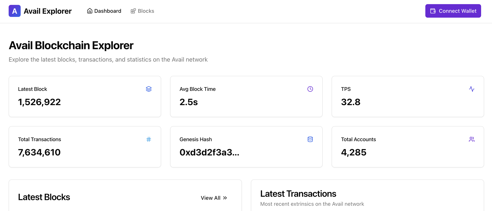

<!-- Improved compatibility of back to top link: See: https://github.com/othneildrew/Best-README-Template/pull/73 -->
<a id="readme-top"></a>


<!-- PROJECT LOGO -->
<br />
<div align="center">
  <a href="https://github.com/annasudol/chain-explorer-avail">
    
  </a>

  <h3 align="center">Avail Chain Explorer</h3>

  <p align="center">
    A modern blockchain explorer for the Avail network
    <br />
    <a href="https://github.com/annasudol/chain-explorer-avail">View Demo</a>
  </p>
</div>


<!-- ABOUT THE PROJECT -->
## About The Project

[![Avail Chain Explorer Screen Shot][product-screenshot]](https://chain-explorer-avail.netlify.app/)

<div align="center">
  
</div>

Avail Chain Explorer is a modern, user-friendly blockchain explorer specifically designed for the Avail network. It allows users to easily explore blocks, transactions, and network statistics on the Avail blockchain.

Key features:
* Browse and search through the latest blocks and transactions
* View detailed information about blocks, including block hash, number, and timestamp
* Examine transaction details and extrinsics
* Track network statistics in real-time
* Connect your wallet to interact with the Avail network

### Built With

This project leverages cutting-edge web technologies to provide a smooth and responsive user experience:

* **Next.js** - The React framework for production
* **React** - A JavaScript library for building user interfaces
* **TypeScript** - JavaScript with syntax for types
* **Tailwind CSS** - A utility-first CSS framework
* **Zustand** - A small, fast and scalable state-management solution
* **Radix UI** - A low-level UI component library

<p align="right">(<a href="#readme-top">back to top</a>)</p>

<!-- GETTING STARTED -->
## Getting Started

To get a local copy up and running, follow these simple steps.

### Prerequisites

This project uses npm as its package manager. Make sure you have the latest version installed.
* npm
  ```sh
  npm install npm@latest -g
  ```

### Installation

1. Clone the repository
   ```sh
   git clone https://github.com/annasudol/chain-explorer-avail.git
   ```
2. Install NPM packages
   ```sh
   npm install
   ```
3. Create a `.env` file based on the `.env.example` template
   ```sh
   cp .env.example .env
   ```
4. Set the appropriate Avail indexer URL in the `.env` file
   ```
   NEXT_PUBLIC_INDEXER_URL="https://turing-indexer.avail.so"
   ```

<p align="right">(<a href="#readme-top">back to top</a>)</p>

<!-- USAGE EXAMPLES -->
## Usage

Run the development server:

```sh
npm run dev
```

Open [http://localhost:3000](http://localhost:3000) with your browser to see the explorer in action.

You can start exploring:
- The latest blocks on the Avail network
- Transaction details and history
- Network statistics
- Connect your wallet to interact with the blockchain


<p align="right">(<a href="#readme-top">back to top</a>)</p>
